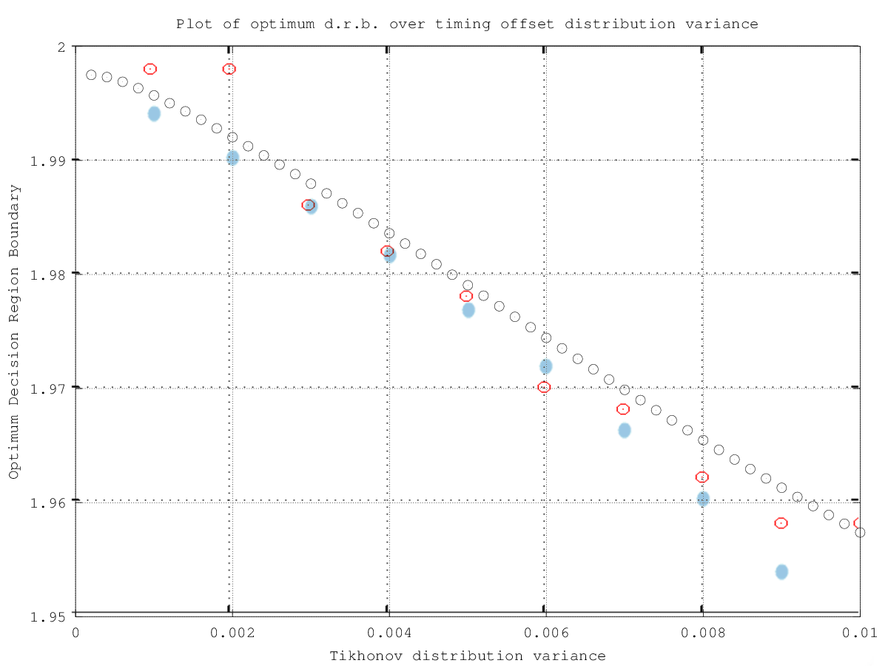

% Fourth Year Project Logbook

Week 1
======

30/09/13 - Exploring simple case with PAM modulation
----------------------------------------------------

I received the *PAM.pdf* file outlining the case where a signal is sent through a channel with AWGN and received with a timing error at the receiver. I read
through the file several times to get an understanding of the underlying equations.

Leaving the Gram-Charlier series aside for the moment, I started getting to grips with Mathematica and implementing the transmission system model:

$$
X = \omega_0 g_0 + \sum_{k=1}^{40} ( \omega_{-k} g_{k} + \omega_k g_k ) + \nu
$$

where $g_k = g((\Delta + k)T)$, $g(t) = (u_T \ast h_l \ast u_R)(t) \times cos(\theta)$ and $\nu$ is a zero-mean Gaussian random variate with
$\sigma_{\nu}^2 = N_0 \varepsilon_R$.

I learnt the basics of the interface, and began inplementing the filter and channel impulse responses (I.R.). I need to double-check the definition of the
Root-Raised Cosine (RRC) Filter, as the impulse response wasn't as expected.

Later, I found the [correct form for the RRC] and double-checked it using Octave. The equation used is listed below. A plot showed that this equation is invalid
at $t = \left [ - \frac{T_s}{ 4 \beta } , 0 , \frac{T_s}{ 4 \beta } \right ]$, so I plan to find its limit at these points using Mathematica to obtain the
complete solution. 

[correct form for the RRC]: http://ntrs.nasa.gov/archive/nasa/casi.ntrs.nasa.gov/20120008631_2012008365.pdf

$$
h_{RRC}(t) = \frac{2 \beta}{\pi \sqrt{T_s}} \frac{cos \left [ (1 + \beta) \frac{\pi t}{T_s} \right ] + \dfrac{sin \left [ (1 - \beta) \frac{\pi t}{T_s} \right ]}{\frac{4 \beta t}{T_s}}}{1 - \left ( \frac{4 \beta t}{T_s} \right )^2}
$$

01/10/13 - Implementing Raised Cosine functions
-----------------------------------------------

I implemented the function above in Mathematica, and using the `Limit` function found the value of the function at the following undetermined points:

$$
h_{RRC}(t) = \left\{
  \begin{array}{l l}
    \dfrac{4 \beta + \pi (1 - \beta)}{2 \pi \sqrt{T_s}} & t = 0 \\
    \dfrac{\beta}{2 \pi \sqrt{T_s}} \left ( \pi sin \left [ \frac{(1 + \beta) \pi}{4 \beta} \right ] - 2 cos \left [ \frac{(1 + \beta) \pi}{4 \beta} \right ] \right ) & t = \pm \frac{T_s}{ 4 \beta } \\
    \dfrac{2 \beta}{\pi \sqrt{T_s}} \dfrac{cos \left [ (1 + \beta) \frac{\pi t}{T_s} \right ] + \dfrac{sin \left [ (1 - \beta) \frac{\pi t}{T_s} \right ]}{\frac{4 \beta t}{T_s}}}{1 - \left ( \frac{4 \beta t}{T_s} \right )^2} & \text{otherwise}
  \end{array}\right.
$$

I also implemented the Raised Cosine function for the channel function, using the impulse response below[^1]. I was unable however to convolve the receiver and
transmitter filter functions using the `Convolve` function, even when I limited the impulse response using a `UnitBox`.

[^1]: Proakis, "Digital Communications" 

$$
h_{RC}(t) = \frac{sinc \left ( \frac{\pi t}{T} \right ) cos \left ( \beta \frac{\pi t}{T} \right )}{1 - \left ( 2 \beta \frac{t}{T} \right )^2}
$$

I looked into Mathematica's treatment of the Gaussian distribution, and figured out how to generate random noise vectors following a Gaussian distribution, as
well as how to generate a list of random binary symbols.

After discussing the convolution issue with David, he suggested that the channel should be initially modelled as ideal and therefore the overall channel and
filter I.R. $g(t)$ can be defined as a Raised Cosine function, as defined above. I should therefore be ready to implement the simple ISI model
tomorrow.

02/10/13 - Wrapping Up the Initial PAM Model
--------------------------------------------

I pulled together the Raised Cosine function and random number generator to impiment the given simplified function for the PAM receiver output, given below.
Playing around with the settings, I was able to show how the $g_k$ function increases with the timing error. I decided to study the Mathematica environment a
little more before carrying on with any programming.

$$
X = \omega_0 g_0 + \sum_{k=1}^{40} ( \omega_{-k} g_{-k} + \omega_k g_k ) + \nu
$$

03/10/13 - Delving deeper into Mathematica
------------------------------------------

I devoted some time into looking through Michael Quinlan's notebooks and better understanding the workings of the `Table` functions and the various plotting
options. Fortunately my notebook was corrupted so I was able to rewrite it and understand the model a bit more. I need to figure out what variance value the
noise PDF should take on, as the noise appears to be overwhelming the timing error effects. Translating the resulting PDF's into patterns is another question that
needs some thought.

Week 1 Summary
--------------

Week 1 was mostly spent becoming acquainted with Mathematica and getting a feel for the equations underlying PAM transmissions. A simple model of a PAM receiver
was constructed.

Goals for Week 2
----------------

*   The PAM model will need to be extended to calculate the optimum decision region boundary from the estimated PDF.
*   A better setup will be required to perform large-scale simulations within an acceptable time period. We will look into applying for an account on the Boole
    cluster.

Week 2
======

07/10/13 - Matrix manipulations
-------------------------------

I decided to spend another day learning about the Mathematica environment, in particular matrix manipulation and generation. I looked into the `Apply`, `Map`
and `Partition` functions and wrote some examples to figure out how to convert mathematical problems to Mathematica notation using matrices. I hope to convert
the code to use matrices tomorrow to hopefully simplify and speed things up.

I also implemented David's equation for properly calculating the AWGN function variance from SNR[^2], from last Friday's meeting.

[^2]: See *davenotes.pdf*

08/10/13 - Fixed I.R. and Kernel Density Estimation
---------------------------------------------------

The first job was to rewrite the code to make use of the simple dot operator to calculate all the ISI components[^3]. With the new code I was able to carry out
many more runs and get much more detailed output. In addition, when I was rewriting the code I noticed a typo in the Raised Cosine I.R. that was degrading
performance in the perfectly synchronised case. With both of these changes made, I decided to use Kernel Density Estimation to see what effects the timing
offset has.

[^3]: The ISI components are now calculated using:
$$
\left [
  \sum_{k=0}^{k=40} \left ( g_k \omega_k^1 + g_{-k} \omega_{-k}^1 \right ) \cdots \sum_{k=0}^{k=40} \left ( g_k \omega_k^m + g_{-k} \omega_{-k}^m \right )
\right ] = \left [ 
  g_{-40} \cdots g_{-1} g_{1} \cdots g_{40}
\right ] \bullet \left [
  \begin{matrix}
    \omega_{-40}^1 & \cdots & \omega_{-40}^m \\
    \vdots         &        & \vdots         \\
    \omega_{-1}^1  & \cdots & \omega_{-1}^m  \\
    \omega_{1}^1   & \cdots & \omega_{1}^m   \\
    \vdots         &        & \vdots         \\
    \omega_{40}^1  & \cdots & \omega_{40}^m  \\
  \end{matrix}
\right ]
$$
    where $\omega_{k}^j$ is the $k$'th ISI with the $j$'th timing offset.

Using offsets of 10\textsuperscript{-15}, 0.05, 0.1 & 0.15, the following values of $g_k, k \in \{ -40 \dots -1, 1 \dots 40 \}$ were calculated.

Using `SmoothKernelDistribution` to perform Kernel Density Enstimation with 1 million points produced the following estimated PDFs for both possible transmitted
values. As the timing error increases, we note that the PDF spreads out, but the mean remains steady.

09/10/13 - Setting up Digital Comms Lab PC
------------------------------------------

With Ger's help, I set up an account on `Digital Comms Lab 1` & `Digital Comms Lab 2` and got the internet working. Mathematica 8 is installed and working on
both machines, we will have to consider whether an upgrade to Mathematica 9 would be useful or not. Git and VNC or similar have to be installed next. A request
was made to the Boole cluster for access for this machine, however the email given (`bcrisupport@bcri.ucc.ie`) was invalid.

10/10/13 - Probing the Elec Eng network
---------------------------------------

After finding out the Boole cluster was no more, I used today to examine what hardware I had available to me. I got access from Ger to the public `UEPC004`
server, and from there I am able to access machines on the elec eng network. I set up a *Remote Desktop Protocol* link to `Digital Comms Lab 1` through this
server, allowing me to control the machine from any location. I am also able to log remotely into EDA lab machines, and run Mathematica 6 on those machines.[^4]
Ger has been known to tweak machines in response to personal requests, so if asked nicely he may let me use two or three of these machines concurrently.

[^4]: The GUI does not work when using `ssh` to access the EDA Lab machines, but using the command `math` to start and operate Mathematica kernels does.

Given these resources, I feel there are three ways I could continue:

* I could upgrade to the latest version of Mathematica on all machines, and set up a Mathematica cluster with `Digital Comms Lab 1` as the front end and the
EDA Lab PCs as remote nodes. With this setup, all machines would act as one (as in a traditional cluster). This would be the easiest to use, but would require
considerate work to set up.
* I could use the `MathLink` interface to acheive a similar, lower-level version of the former, with the EDA Lab machines as independent, remote slaves and
`Digital Comms Lab 1` sending commands to these slaves and collating the replies. This setup is distributed computing with a star topology, and would be easier
to setup. The downside is that the code needs to manually divide the task between each of the nodes, and needs to be well designed to minimise network delays.
* I could simply run the code in parralel on each of the machines available to me, dumping the results to text files, and collate the data at the end. This
would require no setup, and code written on any machine would only require porting to another version of Mathematica. Additionally this seems like it would deal
best with hiccups such as machines going down and it does not depend on a connection between the machines. The downside is there would be some overhead with
collecting the results afterwards.

Week 2 Summary
--------------

I fixed the code written last week and began setting up my simulation environment.

Goals for Week 3
----------------

*   Work out a setup that will allow me to carry out largeer-scale simulations.
*   Adapt the previous code to run in parallel and produce useful machine-readable output.

Week 3
======

14/10/13 - Running longer scripts on the EDA machines
-----------------------------------------------------

Today I spent some time figuring out how to build and run scripts on the EDA machines. I found that defining a module in a text file and copying the Mathematica
code into the module allows the code to be called with input arguments, and writing the output to a text file and placing the module in a loop allows each pass
to be recorded for later parsing[^5]. After running the code overnight, this system appears to work, and is scaleable over multiple machines. The main disadvantage
is the size of these files (7.7MB per 400,000 values), so I must either figure out how to transfer them over the network or see whether reducing the precision
of the output values will reduce the file sizes.

[^5]: Using the `Get` and `Put` methods. The `DumpSave` method is supposed to be more efficient, but was added after Mathematica 6.

15/10/13 - Reducing output size
-------------------------------

Given the 15GB of samples produced the night before was far too much to pull off the machine, I copied 20 million of the samples and plotted them to make sure
the script had worked in practice[^6]. I then looked into how I could reduce the size of the output produced, and decided to replace the `SmoothKernelDistribution`
function (which came in after Mathematica 6.0 and therefore couldn't be used on the EDA machines) with a fine-grained histogram function[^7]. This allowed me to
add the probabilities generated in each sweep to those generated before and keep the output to a handful of 1kB files. I ran the simulation overnight to check it.

[^6]: For the record, I could only use a fraction of them, as loading all 20 million samples crashed the machine for over an hour.

[^7]: I am assuming that both approach the true PDF as $\text{N} \! \rightarrow \! \infty$

16/10/13 - Moving onto 4-PAM
----------------------------

Checking the output from the night before, I get a similar PDF plot as with the `SmoothKernelDistribution` function. I therefore modified the code to examine all
3 decision region boundaries in a 4-PAM system and ran the simulation for 100 million samples per condition. The resulting distributions shown below show
increased probability of error with timing error, as expected, but decision region boundaries in this case remain the same.

I could imagine finding a value for the probability of error and moving onto PSK systems as the next steps in the process.

Week 3 Summary
--------------

Code was written that could be executed in parallel on multiple machines, and this was demonstrated in practice. The code was extended to the 4-PAM case, and
showed no change in optimum decision region boundaries. Upon later consultation with Dave, it seems this is because the decision region boundaries shift due
to a change in the $g_0$ term, and not the appearance of ISI components due to the $g_k$ terms; the latter was believed to be the expected cause, and so the
$g_0$ term was assumed to be 1 in the code.

Goals for Week 4
----------------

*   Re-run the simulations to see if implementing the change in $g_0$ with timing error changes the location of the optimum decision region boundaries.
*   If so, it would be interesting to see if the Gram-Charlier approximation produces the same boundary locations.

Week 4
======

21/10/13 - Implementing the Gram-Charlier series
------------------------------------------------

Over the weekend, I implemented the $g_0$ term fix discussed in our Friday weekly meeting and re-ran the simulation, this time across two machines. Results
showed that the Decision Region Boundary is displaced towards the origin as the timing offset increases. 

I spent Monday carrying out two tasks: 

1.  I re-wrote Dave's Gram-Charlier equations[^2] for Mathematica, and should be ready to try them out tomorrow.
2.  I modified the PAM simulation with a coarser-grained histogram, but more timing offset values, in order to see how the decision variate varies with timing
    offset. The results should be available in the morning.

22/10/13 - More Gram-Charlier series
------------------------------------

The simulation results showed that the decision region boundaries did decrease with timing error, however the histogram was not fine-grained enough to
accurately determine the exact boundary locations, so the simulation was re-run with more bins.

I fixed some bugs in my implementation of the Gram-Charlier series and was able to generate a few plots, which were very similar to those generated by the
simulator, albeit with half the amplitude. A goal for tomorrow is to generate the plots with identical timing offsets to the simulation and compare both plots.

23/10/13 - Proper Gram-Charlier plots
-------------------------------------

The simulation results had been appended to the previous set of results by accident, so the whole thing had to be run again for tomorrow. On a more positive
note, I noticed a missing power in my implementation of the Gram-Charlier series, and the plots are now a lot closer to those generated previously.

Week 4 Summary
--------------

I implemented the Gram-Charlier series and was able to compare the results from the simulationa dn the Gram-Charlier series. These are close, but not exact,
so we will have to look closely at where the differences may be coming from.

Goals for Week 5
----------------

*   I will make use of the long weekend to run some extra-long simulations and compare these to the Gram-Charlier series.

Week 5
======

29/10/13 - Comparing Gram-Charlier to Simulation
------------------------------------------------

The simulations ended, and I was able to compare simulated and gram-charlier PDF plots. I extracted a rough estimate of the decision region boundaries given by both methods and compared them to the corresponding values
of $2 g(\Delta)$, and found very close correlation.

30/10/13 - Applying the Tikhonov Distribution
---------------------------------------------

I was able to implement the Tikhonov Distribution using the equation provided in *PAMTikhonov.pdf*:

$$
F_{\Delta} (y) = \frac{\text{Exp}\left [ \dfrac{cos(2 \pi y)}{(2 \pi \sigma_{\Delta})^2} \right ]}{I_0 \left ( \dfrac{1}{(2 \pi \sigma_{\Delta})^2} \right )} \text{  where  } -\frac{1}{2} \le y \le \frac{1}{2}
$$

Given these timing error probabilities and the optimum decision region boundaries for each timing error, I calculated the overall optimum decision region
boundary for each timing error probability distribution using

$$
B_{\text{OPT}} \sim \sum_{\Delta} \text{P}(\Delta) B_{\text{OPT,}\Delta}
$$

It is important to note that with increasing variance, the probability density function places more weight on larger timing errors outside the range simulated,
so these results are less accurate for higher variances.

Week 5 Summary
--------------

In week 5, I calculated the optimum decision region boundary for a range of timing offsets, through simulation and the Gram-Charlier approximation. I
demonstrated a close correlation between these boundaries and the $2 g_k$ term. A slight difference between the Gram-Charlier approximation was found to be due
to a typo in its implementation. I applied the Tikhonov distribution to the calculated optimum decision region boundaries for each timing offset, in order to
calculate an optimum decision region boundary for a given Tikhonov distribution of timing offsets

Goals for Week 6
----------------

*   On the simulation side, a key goal for week 6 is to randomly generate timing offsets according to the Tikhonov distribution and apply these to the simulation
    as timing offsets, in order to verify correlation with the Gram-Charlier and $2 g_k$ approximations.
*   A typo in the Gram-Charlier implementation has been found and corrected, and it would be interesting to see if this approximation matches $2 g_k$.

Week 6
======

04/11/13 - Fixing errors
------------------------

Dave took a look at my code and spotted errors which I fixed. The fixed Gram-Charlier implementation was found to match $2 g_k$ very closely. The fixed
simulation was left to run overnight; unfortunately Mathematica 6.0 running on the Unix machines was unable to run it, so the number of points had to be reduced.

05/11/13 - Corrected simulation results
---------------------------------------

The produced PDFs were too inaccurate to properly calculate the zero crossing points, so the simulation will have to be run over several days.

Week 6 Summary
--------------

A simulation was constructed that generated timing error offsets according to a Tikhonov distribution of predetermined variance, and used to produce received
symbol PDFs. The simulation was found to run very slowly, and could only be run on Mathematica 9. Ger has been asked whether it would be possible to upgrade the
Unix machines to this version and he will look into it.

Goals for Week 7
----------------

*   Continue running the simulation, trying to speed it up if at all possible.

Week 7
======

11/11/13 - Returning to the UNIX machines
-----------------------------------------

The UNIX machines were upgraded to Mathematica 9 over the weekend, so I was able to port the code in order to run off these. In addition, Dave suggested that I
look into parralising the code. Since these were dual-core machines I was able to make use of Mathematica's `ParallelTable` function to reduce run times a
little. Th simulation will have to run over several days, however, as the expected deviation in optimum decision region boundary is very small.

19/11/13 - Day 9 of Week 7
--------------------------

After several days of running the simulations, we found the optimum decision region boundaries given by the simulations, in red, converged to roughly those
predicted by averaging the optimum decision region boundary of a timing offset over the tikhonov distribution of timing offsets, in blue, given by the equation:

$$
B_{\text{OPT}} \sim \sum_{\Delta} \text{P}(\Delta) B_{\text{OPT,}\Delta}
$$

Week 7 Summary
--------------

Simulations supported the theory that the optimum decision region boundary in the presence of statistically distributed receiver timing errors will decrease
from the expected value. Additionally, it was shown through simulation that the new optimum decision region boundary can be aproximated, assuming a known
distribution of these timing errors, by averaging the optimum decision region boundary given each timing offset over the distribution of timing offsets.

Goals for Week 8
----------------

*   Verify that the Gram-Charlier series provides an adequate approximation to the received symbol PDF in the presence of timing errors.
*   Provide numerical values for the probability of error $P_e$ in the presence of a distribution of timing errors.

Week 8
======

Week 8 Summary
--------------

After spending the Christmas break reviewing the literature on Rayleigh fading, mainly *Proakis*, I implemented the Rayleigh distribution as a modified Nagakami-n distribution \footnote{The Rayleigh distribution is a special case of the Nagakami-n distribution, with n=1} I implemented this as well as a multi-receiver combining system and added it to the existing simulation. Following a meeting with Dave and Colin, we decided to proceed as follows:

*   Run simulations similar to those run before Christmas to determine numerically the optimum decision region boundaries and corresponding error probabilities in the presence of Rayleigh fading with Equal Gain Combining (EGC).
*   Alongside this, attempt to provide an analytical derivation for the optimum decision region boundaries in the presence of timing errors in a non-fading environment. Should the above simulations show merit in modifying the decision region boundaries, this could then be adapted to the fading case later on.

Goals for Week 9
----------------

*   Implement the simulation. This is expected to run for the duration of Week 8, and demonstrate the optimum decision region boundaries for an EGC receiver with Rayleigh fading. The main goal is to determine if different decision region boundaries would reduce the probability of error.
*   Attempt to describe the system analytically, ignoring fading. This will be based on a Gram-Charlier aproximation.

Week 9
======

13/01/14 - Examining combining and fading
-----------------------------------------

Over the weekend, three separate approximate simulations were run to examine receiver performance in three cases:

1.  Similar to before Christmas, a single-receiver system in a non-fading environment
2.  A multi-antenna system using EGC in a non-fading environment
3.  An EGC system in the presence of Rayleigh fading

Initial simulations for case 3. showed reduced optimum decision region boundaries in the presence of Rayleigh fading, which appeared to remain constant with changing timing offset variance. A simulation of case 2. showed changing optimum decision region boundaries for different timing offset variances. A more detailed simulation of case 3. examining more variances was commenced, and is expected to finish mid-week.

14/01/14 - Planning an analytical analysis of the non-fading case
-----------------------------------------------------------------

I found an implementation of the Gram-Charlier series and Tikhonov distribution I had developped previously that could be used as a basis for an analytical exploration of the project topic. The code produces a Gram-Charlier PDF for a range of timing offsets, calculates the optimum decision region boundary for each, and averages these boundaries over the Tikhonov distribution. Dave suggested that while this approach wasn't mathematically correct, if the Gram-Charlier PDF's were averaged over the Tikhonov distriution to provide an overall PDF, the optimum decision region boundary could be calculated from this.

15/01/14 - Evaluating the Gram-Charlier distribution over the Tikhonov distribution
-----------------------------------------------------------------------------------

I carried out the changes detailed above, and added a loop to numerically estimate the location of the PDF crossings, thereby estimating the optimum decision region boundaries. Unfortunately there was not enough time to run the code over all possible conditions.

One of the simulations begun at the start of the week quit unexpectedly, and had to be restarted, moving back the expected end-date for the simulations to Friday.

16/01/14 - Results for the above
--------------------------------

I was able to run the Tikhonov-Gram-Charlier code described above and thus plot the optimum decision region boundaries for Tikhonov-distributed timing offsets, assuming a Gram-Charlier approximation for the received symbol. These correlated strongly with the optimum boundaries found through simulation.

Week 9 Summary
--------------

A simulation covering the 4-PAM case studied before Christmas was extended with a 4-channel EGC system and simulated Rayleigh channel fading. This simulation was run over the course of the week and (*proved xyz*...)

A rough analytical study of the non-fading timing error model examined before Christmas was carried out. The PDF's of various cases with a fixed timing offset were generated, and averaged over a discretised Tikhonov distribution to estimate the PDF of the system in the presence of Tikhonov distributed timing offsets. This was carried out for a range of Tikhonov distribution variances to examine different conditions. The optimum decision region boundary for each condition was found numerically and found to correlate strongly with the locations determined through simulation previously, with the exception of some low-variance points.

Goals for Week 10
-----------------

*   Examine the performance of the system in the presence of Rayleigh distributed channel fading.
*   Determine the probability of error of the system in the non-fading case, and evaluate any performance gains from using the calculated optimum decision region boundaries.

Week 10
=======

20/01/14 - Rayleigh Fading Results
----------------------------------

Simulation ended over the weekend and showed an optimum decision region boundary around 1.72, for Tikhonov variances of 0.001 to 0.010. This is an interesting result, as it suggests that in this particular case the optimum decision region boundary is only loosely related to the Tikhonov variance, which would imply that knowledge of the timing statistics is less important in implementation than previously thought.

Dave produced an analytical solution for the optimum decision region boundary in the non-fading case, which demonstrated clear BER gains (20-33%).

21/01/14 - Implementing Dave's suggestions
------------------------------------------

Following some consideration, Dave suggested that the SNR of 8dB used in the simulation was too low for 4-PAM, and it's possible that the ODRB of 1.72 seen was the lower bound for the ODRB. We settled on a more reasonable SNR of 20dB, and decided to apply each set of random conditions to both posble sent symbols $\omega_0$ = 1,3 so that we would only have to run the simulations once. Another suggestion made by Dave was to apply a different timing offset to each channel, as each channel has a separate receiver, and therefore independent timing. I also implemented Maximal-Ratio Combining as an option in order to compare the performance of both systems.

Week 10 Summary
---------------

This week we were able to show reduced optimum decision region boundaries in the presence of Rayleigh fading with Equal-Gain Combining. These results showed that the performance of the EGC receiver could be considerably improved when facing low SNR. It was decided that the short-term goal would be to evaluate the receiver's performance with a more reasonable SNR, and compare it to the performance of a Maximal-Ratio Combining system under similar conditions.

Work stopped mid-week to facilitate the author's funding application, and is expected to resume in full next week.

Goals for Week 11
-----------------

*   Evaluate the error rate of an EGC receiver with optimised decision region boundaries in Rayleigh fading with an SNR of 20dB.
*   Similarly, evaluate the error rate of a MRC receiver in similar conditions.
*   Compare and contrast the performance of each, taking into account the higher area and power requirements of the latter.

Week 11
=======

27/01/14 - Simulating EGC and MRC
---------------------------------

The changes discussed in the last entry were implemented, and both simulations started.

