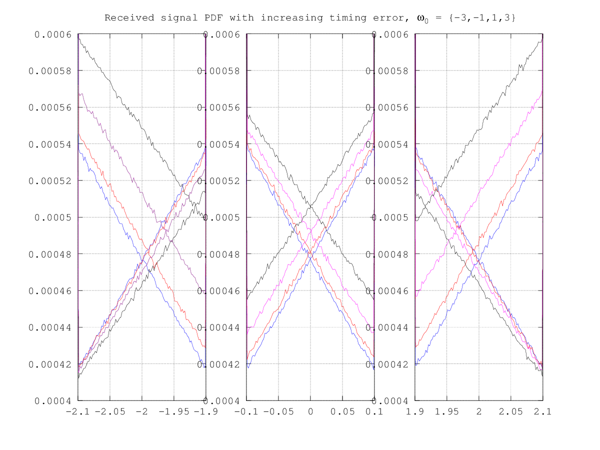
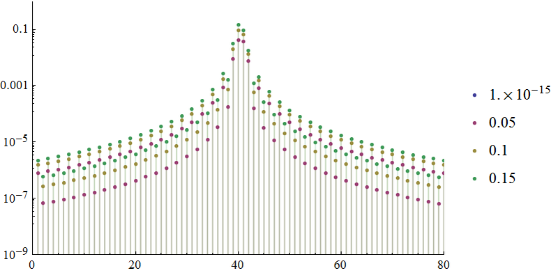

Gram-Charlier Probability Density Function
==========================================

$$
f_{X|\Delta}(y) = \frac{1}{\sqrt{2 \pi} \sigma_X} \: \text{exp} \left ( - \frac{(y - \omega_0 g_0)^2}{2 \sigma_X^2} \right ) \left [ 1 + \sum \limits_{m=2}^{\infty} \frac{\alpha_{2m}}{(2m)! \sigma_X^{2m}}  \: H_{2m} \! \left ( \frac{y-\omega_0 g_0}{\sigma_X} \right ) \right ]
$$

$$
\sigma_X^2 = \sigma_{\mu}^2 + \frac{1}{3} \left ( L^2 - 1 \right ) \sum\limits_{i=2}^{m-2} \binom{2m-1}{wi} \kappa_{2(m-i)} \alpha_{2i} \: \: m \ge 2
$$

$$
\kappa_m = - j^m T_{m-1} \frac{L^m - 1}{2^m - 1} \sum\limits_{k=1}^{\infty} \left ( g_{-k}^m + g_k^m \right ) \: \: m \ge 2
$$

$$
T_m = \left . \frac{d^m}{d t^m} tan (t) \right |_{t=0}
$$

$$
H_m (y) = (-1)^m e^{y^2 / 2} \frac{d^m}{d y^m} e^{- y^2 / 2}
$$

*or*

$$
H_m (y) = \sum\limits_{i=0}^{m / 2} (-1)^i \frac{m!}{(m-2i)!} \frac{1}{2^i i!} y^{m-2i}
$$

\clearpage

Derivation of the Gram-Charlier Integral
========================================

Starting with the Gram-Charlier definition described earlier,

$$
f_{X|\Delta}(y) = \frac{1}{\sigma_X} \: \phi \! \left ( \frac{y-\mu_X}{\sigma} \right ) + \sum \limits_{m=2}^M \frac{\alpha_{2m}}{(2m)! \sigma_X^{2m}} \left [ \frac{1}{\sigma_X} \: \phi \! \left ( \frac{y-\mu_X}{\sigma} \right ) \: H_{2m} \! \left ( \frac{y-\mu_X}{\sigma_X} \right ) \right ]
$$

and incorporating the given identites,

$$
\int \limits_{-\infty}^x \frac{1}{\sigma} \: \phi \! \left ( \frac{y-\mu}{\sigma} \right ) dy =
\frac{1}{2} \left ( 1 + \text{erf} \! \left ( \frac{x-\mu}{\sqrt{2} \sigma} \right ) \right )
$$

$$
\int \limits_{-\infty}^x \frac{1}{\sigma} \: \phi \! \left ( \frac{y-\mu}{\sigma} \right ) H_m \! \left ( \frac{y-\mu}{\sigma} \right ) dy =
- \phi \! \left ( \frac{x-\mu}{\sigma} \right ) H_{m-1} \! \left ( \frac{x-\mu}{\sigma} \right )
$$

the solution for the integral of the Gram-Charlier series was found to be:

$$
\int \limits_{- \infty}^x f_{X|\Delta}(y) = \frac{1}{2} \left ( 1 + \text{erf} \! \left ( \frac{x-\mu_X}{\sqrt{2} \sigma_X} \right ) \right ) - \sum \limits_{m=2}^M \frac{\alpha_{2m}}{(2m)! \sigma_x^{2m}} \: \: \phi \! \left ( \frac{x-\mu_X}{\sigma_X} \right ) H_{2m-1} \! \left ( \frac{x-\mu_X}{\sigma_X} \right )
$$

\clearpage

\clearpage

\clearpage

\clearpage

\clearpage

\clearpage

\clearpage

\clearpage

\clearpage

