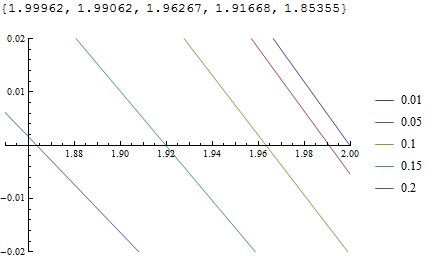
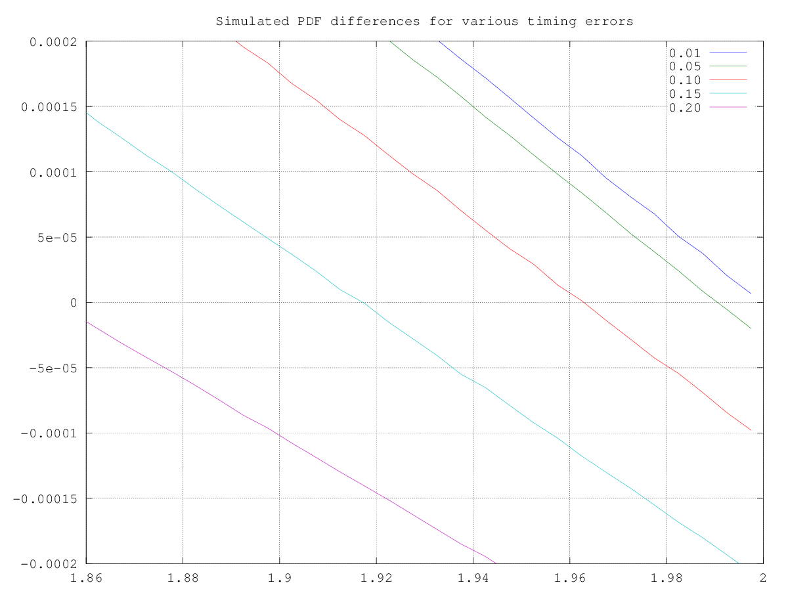
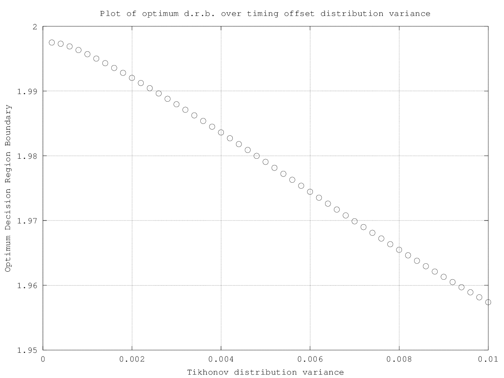

Week 4
======

21/10/13 - Implementing the Gram-Charlier series
------------------------------------------------

Over the weekend, I implemented the $g_0$ term fix discussed in our Friday weekly meeting and re-ran the simulation, this time across two machines. Results
showed that the Decision Region Boundary is displaced towards the origin as the timing offset increases. 

I spent Monday carrying out two tasks: 

1.  I re-wrote Dave's Gram-Charlier equations[^2] for Mathematica, and should be ready to try them out tomorrow.
2.  I modified the PAM simulation with a coarser-grained histogram, but more timing offset values, in order to see how the decision variate varies with timing
    offset. The results should be available in the morning.

22/10/13 - More Gram-Charlier series
------------------------------------

The simulation results showed that the decision region boundaries did decrease with timing error, however the histogram was not fine-grained enough to
accurately determine the exact boundary locations, so the simulation was re-run with more bins.

I fixed some bugs in my implementation of the Gram-Charlier series and was able to generate a few plots, which were very similar to those generated by the
simulator, albeit with half the amplitude. A goal for tomorrow is to generate the plots with identical timing offsets to the simulation and compare both plots.

23/10/13 - Proper Gram-Charlier plots
-------------------------------------

The simulation results had been appended to the previous set of results by accident, so the whole thing had to be run again for tomorrow. On a more positive
note, I noticed a missing power in my implementation of the Gram-Charlier series, and the plots are now a lot closer to those generated previously.

Week 5
======

29/10/13 - Comparing Gram-Charlier to Simulation
------------------------------------------------

The simulations ended, and I was able to compare simulated and gram-charlier PDF plots. I extracted a rough estimate of the decision region boundaries given by both methods and compared them to the corresponding values
of $2 g(\Delta)$, and found very close correlation.

30/10/13 - Applying the Tikhonov Distribution
---------------------------------------------

I was able to implement the Tikhonov Distribution using the equation provided in *PAMTikhonov.pdf*:

$$
F_{\Delta} (y) = \frac{\text{Exp}\left [ \dfrac{cos(2 \pi y)}{(2 \pi \sigma_{\Delta})^2} \right ]}{I_0 \left ( \dfrac{1}{(2 \pi \sigma_{\Delta})^2} \right )} \text{  where  } -\frac{1}{2} \le y \le \frac{1}{2}
$$

Given these timing error probabilities and the optimum decision region boundaries for each timing error, I calculated the overall optimum decision region
boundary for each timing error probability distribution using

$$
B_{\text{OPT}} \sim \sum_{\Delta} \text{P}(\Delta) B_{\text{OPT,}\Delta}
$$

It is important to note that with increasing variance, the probability density function places more weight on larger timing errors outside the range simulated,
so these results are less accurate for higher variances.

Appendix
========

Table of Decision Region Boundaries
-----------------------------------

Timing Error  DRB (sim)  DRB (G-C)  g($\Delta$)
------------  ---------  ---------  -----------
0.010000      1.995      2.000      2.000
0.020000      1.995      1.999      1.998
0.030000      1.995      1.997      1.997
0.040000      1.995      1.995      1.994
0.050000      1.990      1.991      1.991
0.060000      1.985      1.987      1.987
0.070000      1.980      1.982      1.982
0.080000      1.975      1.977      1.976
0.090000      1.970      1.971      1.970
0.100000      1.965      1.964      1.963
0.110000      1.955      1.956      1.955
0.120000      1.945      1.948      1.946
0.130000      1.935      1.939      1.937
0.140000      1.925      1.930      1.927
0.150000      1.915      1.920      1.917
0.160000      1.905      1.910      1.905
0.170000      1.895      1.899      1.893
0.180000      1.880      1.888      1.881
0.190000      1.865      1.876      1.867
0.200000      1.855      1.864      1.854
0.210000      1.840
0.220000      1.825
0.230000      1.810 
0.240000      1.790 
0.250000      1.775
0.260000      1.755 
0.270000      1.740
0.280000      1.720
0.290000      1.700 
0.300000      1.680 

Obtimum Decision Region Boundaries for various timing error distributions with simulated data
---------------------------------------------------------------------------------------------

Varience  Optimum Boundary
--------  ----------------                
0.001     1.996                                                      
0.002     1.992                                                      
0.003     1.988                                                      
0.004     1.984                                                      
0.005     1.979                                                      
0.006     1.974                                                      
0.007     1.970                                                      
0.008     1.965                                                     
0.009     1.961                                    
0.010     1.957

Plots
-----

